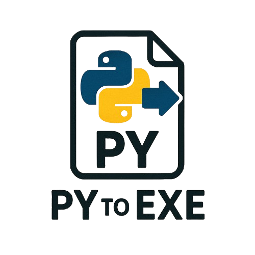

# PyScript-Toolkit

# PyScript Toolkit v2.0 - Logo Harmony

 Herramienta de escritorio profesional para compilar y ofuscar scripts de Python, con una interfaz gráfica moderna y personalizable construida con PyQt5.

## Tabla de Contenidos

-   [Descripción](#descripción)
-   [Características Principales](#características-principales)
-   [Tema Visual: Logo Harmony](#tema-visual-logo-harmony)
-   [Tecnologías Utilizadas](#tecnologías-utilizadas)
-   [Prerrequisitos](#prerrequisitos)
-   [Instalación](#instalación)
-   [Uso](#uso)
-   [Estructura del Proyecto](#estructura-del-proyecto)
-   [Desarrollador](#desarrollador)
-   [Contribuciones](#contribuciones)
-   [Licencia](#licencia)

## Descripción

**PyScript Toolkit** es una aplicación de Python que proporciona una interfaz gráfica de usuario (GUI) intuitiva para dos tareas comunes en el desarrollo de Python:

1.  **Compilación de Scripts a Ejecutables (.EXE):** Utiliza PyInstaller para empaquetar tus scripts `.py` en archivos ejecutables independientes para Windows, permitiendo una fácil distribución sin necesidad de que el usuario final tenga Python instalado.
2.  **Ofuscación de Código Python:** Emplea PyArmor para proteger tu código fuente Python, dificultando la ingeniería inversa de tus scripts distribuidos.

La aplicación cuenta con una interfaz de usuario moderna y elegante, con un tema personalizable llamado "Logo Harmony" que utiliza una paleta de colores verde azulado oscuro y detalles en amarillo dorado.

## Características Principales

* **Compilador Integrado:**
    * Selecciona tu archivo `.py`.
    * Opcionalmente, añade un archivo de ícono (`.ico`) para tu ejecutable.
    * Genera un ejecutable (`.exe`) con un solo clic.
    * Visualiza la salida y los errores del proceso de compilación (PyInstaller) en tiempo real.
* **Ofuscador Integrado:**
    * Selecciona tu archivo `.py` para ofuscarlo.
    * Ofusca tu script usando PyArmor.
    * Visualiza la salida y los errores del proceso de ofuscación.
* **Interfaz Gráfica Amigable:**
    * Diseño moderno con barra lateral de navegación.
    * Páginas dedicadas para cada herramienta (Compilador, Ofuscador).
    * Tema visual "Logo Harmony" con colores personalizables.
    * Mensajes de estado y notificaciones claras.
    * Diálogo "Acerca de" con información de la aplicación y del desarrollador.
* **Personalización:**
    * Fácilmente adaptable si se desea modificar la paleta de colores o el logo.
    * Iconos estándar del sistema para una apariencia nativa.

## Tema Visual: Logo Harmony

La aplicación utiliza una paleta de colores personalizada denominada "Logo Harmony" para una apariencia cohesiva y profesional. Los colores principales son:

* **Fondo Principal (DARK_TEAL_BG):** `#0D3B3F` (Verde azulado oscuro profundo)
* **Barra Lateral (SIDEBAR_TEAL_BG):** `#0A2F33` (Teal un poco más oscuro)
* **Acento (LOGO_YELLOW):** `#FFD700` (Amarillo/Dorado del logo)
* **Texto Principal (MAIN_TEXT_COLOR):** `#E0F2F1` (Blanco hueso / Cian muy pálido)
* **Entradas de Texto (INPUT_BG):** `#082428` (Fondo de inputs, más oscuro)

*Consulta el código fuente para ver la paleta completa y los estilos CSS de Qt.*

## Tecnologías Utilizadas

* **Python 3:** Lenguaje de programación principal.
* **PyQt5:** Biblioteca para la creación de la interfaz gráfica de usuario.
* **PyInstaller:** Herramienta para convertir scripts de Python en ejecutables independientes.
* **PyArmor:** Herramienta para ofuscar scripts de Python.

## Prerrequisitos

Antes de ejecutar la aplicación, asegúrate de tener instalados los siguientes componentes:

* **Python 3.x:** Descárgalo desde [python.org](https://www.python.org/)
* **PyQt5:**
    ```bash
    pip install PyQt5
    ```
* **PyInstaller:**
    ```bash
    pip install pyinstaller
    ```
* **PyArmor:**
    ```bash
    pip install pyarmor
    ```
* **Un archivo `logo.png`:** Coloca tu logo con este nombre en el mismo directorio que el script principal. La aplicación lo escalará a un ancho de 160px. Si no se encuentra, se mostrará un mensaje de advertencia.

## Instalación

1.  **Clona el repositorio (o descarga los archivos):**
    ```bash
    git clone https://[URL-DE-TU-REPOSITORIO-AQUI]/PyScript-Toolkit.git
    cd PyScript-Toolkit
    ```
    O simplemente descarga el archivo `.py` proporcionado.

2.  **Instala las dependencias:**
    Asegúrate de que todos los paquetes listados en [Prerrequisitos](#prerrequisitos) están instalados en tu entorno de Python.

3.  **Prepara el logo:**
    Coloca un archivo de imagen llamado `logo.png` en el mismo directorio que el script principal (por ejemplo, `main.py` o como hayas nombrado tu archivo).

## Uso

1.  **Ejecuta la aplicación:**
    Abre una terminal o línea de comandos, navega al directorio donde guardaste el script y ejecuta:
    ```bash
    python tu_nombre_de_script.py
    ```
    (Reemplaza `tu_nombre_de_script.py` con el nombre real de tu archivo Python).

2.  **Navegación:**
    * Utiliza la lista en la barra lateral izquierda para cambiar entre la herramienta **Compilador** y **Ofuscador**.

3.  **Compilador:**
    * Haz clic en "Examinar..." para seleccionar el archivo Python (`.py` o `.pyw`) que deseas compilar.
    * Opcionalmente, haz clic en "Examinar..." para seleccionar un archivo de ícono (`.ico`) para tu ejecutable.
    * Haz clic en el botón "Compilar a EXE".
    * La salida del proceso de PyInstaller (incluyendo cualquier error) se mostrará en el área de texto inferior.
    * El ejecutable compilado se encontrará generalmente en una carpeta `dist` dentro del directorio del script.

4.  **Ofuscador:**
    * Haz clic en "Examinar..." para seleccionar el archivo Python (`.py` o `.pyw`) que deseas ofuscar.
    * Haz clic en el botón "Ofuscar Script".
    * La salida del proceso de PyArmor se mostrará en el área de texto inferior.
    * Los scripts ofuscados se encontrarán generalmente en una carpeta `dist` (creada por PyArmor) dentro del directorio del script original.

5.  **Menú Ayuda:**
    * Ve a `Ayuda > Acerca de PyScript Toolkit` para ver información sobre la aplicación y el desarrollador.

## Estructura del Proyecto (Ejemplo)
